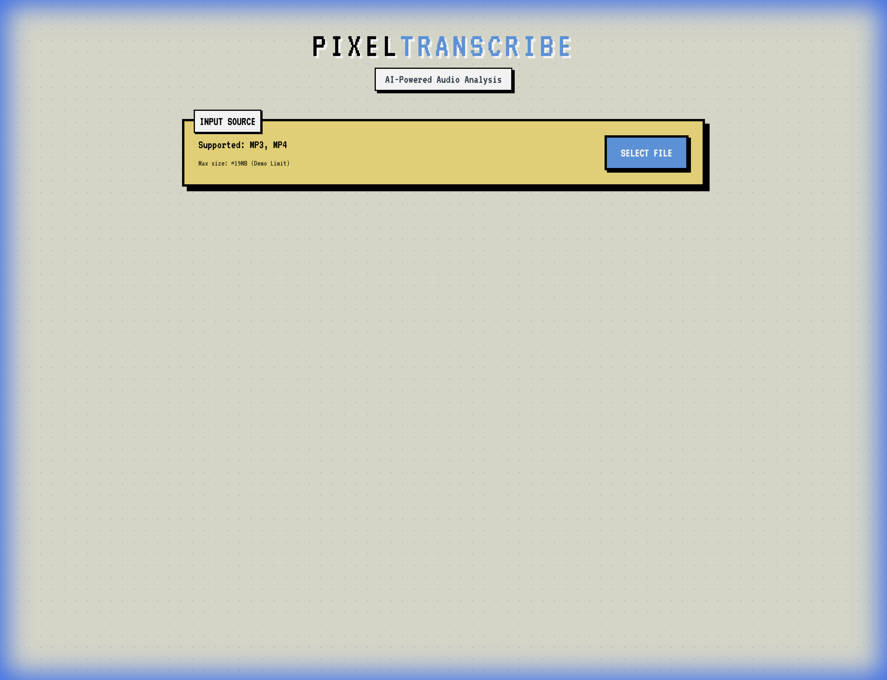
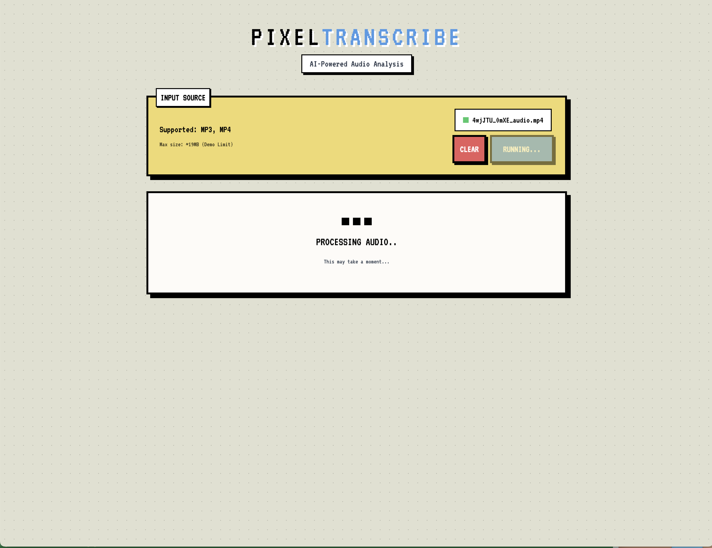
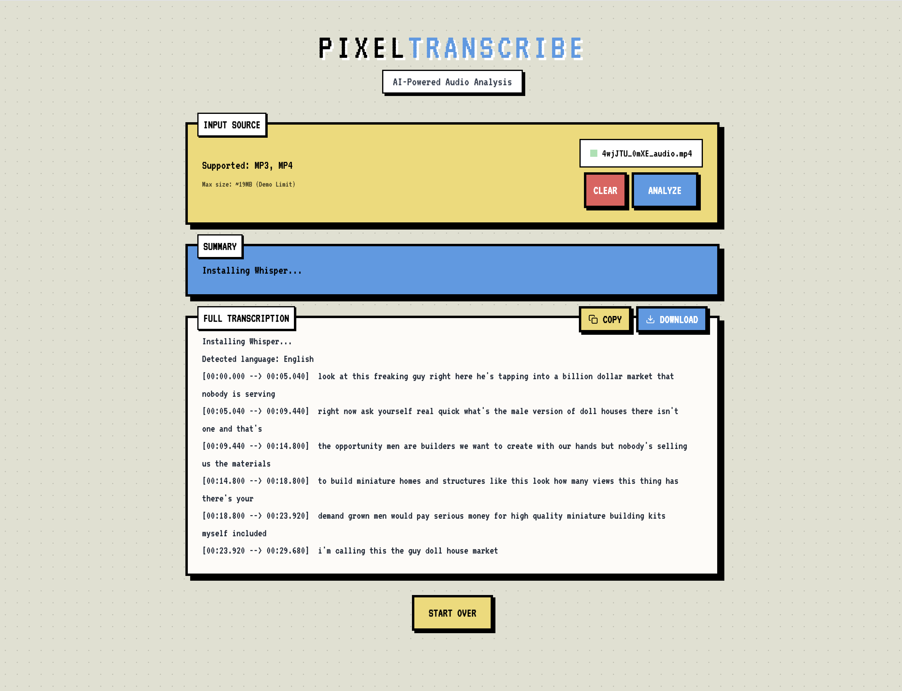
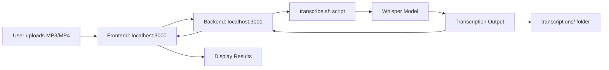

# PixelTranscribe

A retro pixel-art themed web application that transcribes audio and video files using OpenAI's Whisper model running locally via a shell script.





## What is PixelTranscribe?

PixelTranscribe is a full-stack application that combines a React frontend with a Node.js backend to provide audio transcription services. The app features a unique 16-bit pixel art aesthetic and uses a local Whisper installation for privacy-focused, offline transcription.

## How It Works

The application consists of three main components:

### 1. **Frontend (React + Vite)**
- Runs on `http://localhost:3000/`
- Provides a retro-styled UI for file uploads
- Displays transcription results with copy and download functionality
- Built with React, TypeScript, and Vite

### 2. **Backend (Express Server)**
- Runs on `http://localhost:3001/`
- Handles file uploads via multipart/form-data
- Executes the transcription shell script
- Returns transcription and summary as JSON

### 3. **Transcription Engine (Shell Script)**
- `transcribe.sh` - A zsh script that manages Whisper
- Automatically creates and manages a Python virtual environment (`whisper-venv/`)
- Installs Whisper and dependencies on first run
- Outputs transcription files to `transcriptions/` directory
- Supports multiple output formats (txt, srt, vtt, tsv, json)

## Process Flow



## Features

- **Retro Pixel Art UI** - Unique 16-bit aesthetic with custom components
- **Privacy-First** - All transcription happens locally, no data sent to external APIs
- **Multiple Formats** - Outputs TXT, SRT, VTT, TSV, and JSON
- **Copy & Download** - Easy clipboard copy and text file download
- **Simple Summary** - Auto-generated summary from transcription
- **Audio & Video Support** - Accepts MP3, MP4, WAV formats

## Setup and Installation

### Prerequisites

- **Node.js** (v18 or higher) and npm
- **Python 3** and pip
- **ffmpeg** (required by Whisper)
  ```bash
  # macOS
  brew install ffmpeg
  
  # Ubuntu/Debian
  sudo apt install ffmpeg
  ```

### Installation Steps

1. **Clone the repository**
   ```bash
   git clone git@github-trseeds:im-trs/pixeltranscribe.git
   cd pixeltranscribe
   ```

2. **Install Node dependencies**
   ```bash
   npm install
   ```

3. **Make the transcription script executable**
   ```bash
   chmod +x transcribe.sh
   ```

4. **Run the application**
   ```bash
   npm start
   ```
   This command runs both the backend and frontend concurrently.
   - Frontend: `http://localhost:3000`
   - Backend: `http://localhost:3001`

### First Run

On the first transcription, the `transcribe.sh` script will:
1. Create a Python virtual environment (`whisper-venv/`)
2. Install Whisper and its dependencies (this may take a few minutes)
3. Subsequent transcriptions will be much faster

## Usage

1. Open your browser to `http://localhost:3000`
2. Click **Select File** and choose an MP3 or MP4 file
3. Click **Analyze** to start transcription
4. View the summary and full transcription
5. Use **Copy** to copy text to clipboard or **Download** to save as a `.txt` file

## Project Structure

```
pixeltranscribe/
├── App.tsx                 # Main React component
├── components/             # Reusable UI components
│   ├── RetroButton.tsx
│   ├── RetroCard.tsx
│   └── LoadingIndicator.tsx
├── services/               # API service layer
│   └── geminiService.ts
├── server.js               # Express backend server
├── transcribe.sh           # Whisper transcription script
├── uploads/                # Temporary file storage (gitignored)
├── transcriptions/         # Whisper output files (gitignored)
└── whisper-venv/           # Python virtual env (gitignored)
```

## Tech Stack

**Frontend:**
- React 19
- TypeScript
- Vite
- Custom CSS (pixel art theme)

**Backend:**
- Express.js
- Multer (file uploads)
- CORS

**Transcription:**
- OpenAI Whisper (via shell script)
- Python virtual environment
- ffmpeg

## Troubleshooting

### Port Already in Use
If ports 3000 or 3001 are occupied:
```bash
# Kill process on port 3000
lsof -ti:3000 | xargs kill -9

# Kill process on port 3001
lsof -ti:3001 | xargs kill -9
```

### Whisper Installation Issues
If Whisper fails to install:
```bash
# Remove the virtual environment and try again
rm -rf whisper-venv/
```

### ffmpeg Not Found
Ensure ffmpeg is installed and in your PATH:
```bash
ffmpeg -version
```

## License

MIT

## Contributing

Contributions are welcome! Please feel free to submit a Pull Request.

## Acknowledgments

- [OpenAI Whisper](https://github.com/openai/whisper) for the transcription model
- Pixel art design inspired by classic 16-bit aesthetics
